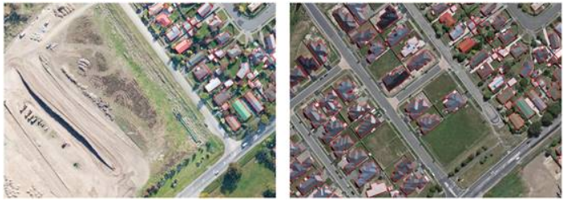

# Building Change Detection Dataset

## Description
Building change detection dataset covers an area hitten by a 6.3-magnitude earthquake in February 2011 and rebuilt in the following years. This dataset consists of one multi-temporal aerial image-pairs with a size of 32507×15354 pixels. The spatial resolution of these images is 0.075m per pixel. 

## Link
You can download this dataset in the website: https://study.rsgis.whu.edu.cn/pages/download/building_dataset.html  

## Citation
If you use their dataset, we recommend you might cite their work:  
[1] Shunping Ji, Shiqing Wei, Meng Lu, Fully Convolutional Networks for Multi-Source Building Extraction from An Open Aerial and Satellite Imagery Dataset [J]. IEEE Transactions on geoscience and remote sensing, 2018.