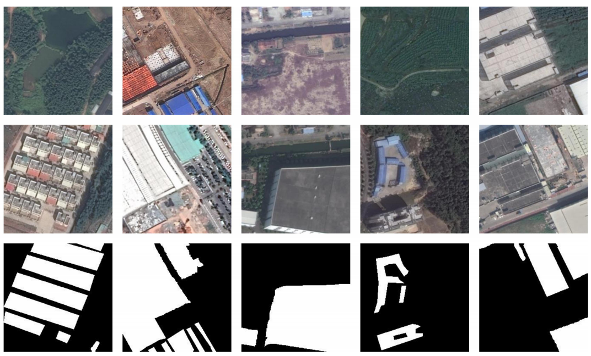

# Google Dataset

<div align=center></div>

## Description
In Google dataset, The images were acquired during the periods between 2006 and 2019, covering the suburb areas of Guangzhou City, China, where the urbanization process was rapid in the past decade. To facilitate image pair generation, Google Earth service through the BIGEMAP software (http://www.bigemap.com) was adopted to collect 19 season-varying VHR images pairs with three bands of red, green, and blue, a spatial resolution of 0.55 m, and the size ranging from 1006×1168 pixels to 4936×5224 pixels. The image changes include waters, roads, farmland, bare land, forests, buildings, ships, etc. 
## Links
You can download this dataset in https://github.com/daifeng2016/Change-Detection-Dataset-for-High-Resolution-Satellite-Imagery

## References
If you use this dataset for your projects, please take the time to cite their paper:  
```
@ARTICLE{SemiCDNetPeng2020,
  author={D. {Peng} and L. {Bruzzone} and Y. {Zhang} and H. {Guan} and H. {Ding} and X. {Huang}},
  journal={IEEE Transactions on Geoscience and Remote Sensing}, 
  title={SemiCDNet: A Semisupervised Convolutional Neural Network for Change Detection in High Resolution Remote-Sensing Images}, 
  year={2020},
  volume={},
  number={},
  pages={1-16},
  doi={10.1109/TGRS.2020.3011913}
}
```