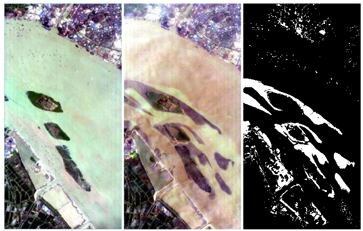

# River Dataset for Hyperspectral Change Detection

## Description
The two hyperspectral images were acquired at May 3, 2013, and December 31, 2013, respectively in Jiangsu province, China. This data set has a size of 463×241 pixels, with 198 bands available after noisy band removal. In ground-truth map, white pixels represent changed portions and black pixels mean unchanged parts.

## Links
You can download this dataset in https://drive.google.com/u/0/uc?id=1cWy6KqE0rymSk5-ytqr7wM1yLMKLukfP&export=download

## References
If you use this data set for your projects, please take the time to cite their paper:  
[1] Q. Wang, Z. Yuan, Q. Du, and X. Li, “GETNET: A General End-To-End 2-D CNN Framework for Hyperspectral Image Change Detection,” IEEE Trans. Geosci. Remote Sens., vol. 57, no. 1, pp. 3–13, 2019.