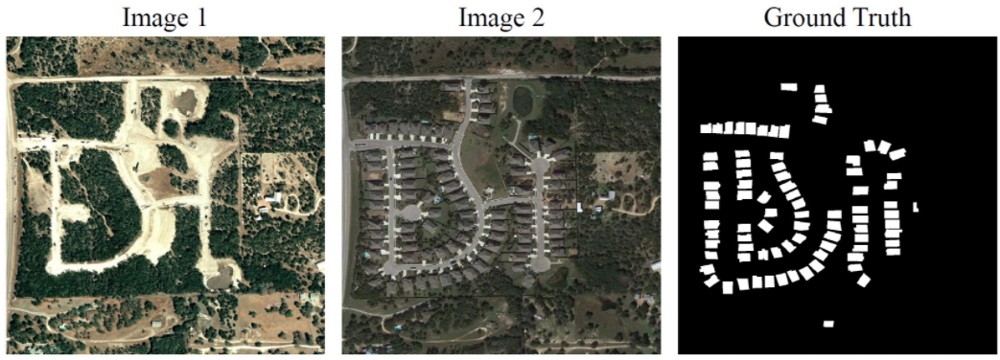

# LEVIR-CD
<div align=center></div>

## Description
LEVIR-CD is a new large-scale remote sensing building Change Detection dataset. LEVIR-CD consists of 637 very high-resolution (VHR, 0.5m/pixel) Google Earth (GE) image patch pairs with a size of 1024 × 1024 pixels. These bitemporal images with time span of 5 to 14 years have significant land-use changes, especially the construction growth. LEVIR-CD covers various types of buildings, such as villa residences, tall apartments, small garages and large warehouses. Here, we focus on building-related changes, including the building growth (the change from soil/grass/hardened ground or building under construction to new build-up regions) and the building decline. These bitemporal images are annotated by remote sensing image interpretation experts using binary labels (1 for change and 0 for unchanged). Each sample in our dataset is annotated by one annotator and then double-checked by another to produce high-quality annotations. The fully annotated LEVIR-CD contains a total of 31,333 individual change building instances.

## Links
You can download this dataset in https://justchenhao.github.io/LEVIR/

## References
If you use this data set for your projects, please take the time to cite their paper:  
```
@Article{Chen2020,
AUTHOR = {Chen, Hao and Shi, Zhenwei},
TITLE = {A Spatial-Temporal Attention-Based Method and a New Dataset for Remote Sensing Image Change Detection},
JOURNAL = {Remote Sensing},
VOLUME = {12},
YEAR = {2020},
NUMBER = {10},
ARTICLE-NUMBER = {1662},
URL = {https://www.mdpi.com/2072-4292/12/10/1662},
ISSN = {2072-4292},
DOI = {10.3390/rs12101662}
}
```