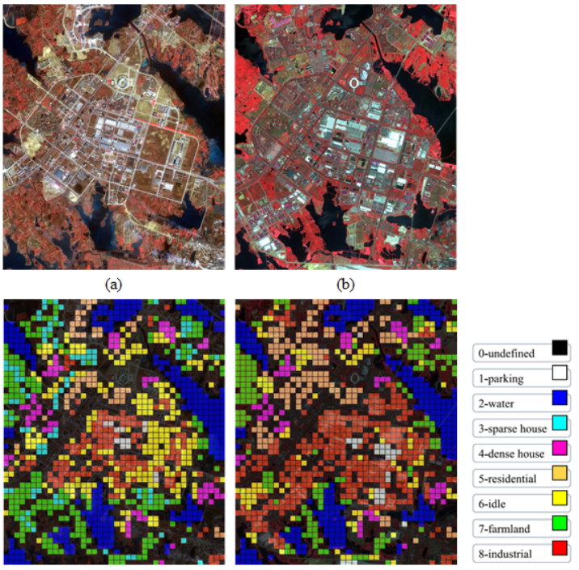

# Datasets used in PCAKmeans
<div align=center></div>

## Description of the dataset
The Wuhan multi-temperature scene (MtS-WH) data set is mainly used for theoretical research and verification of scene change detection methods. Scene change detection is  detecting and analyzing the changes of land-use in a certain area at the scene semantic level.
This dataset consists of two large-size VHR images, which have a size of 7200x6000 and are respectively acquired by IKONOS sensors in Feb, 2002 and Jun, 2009. The images cover the Hanyang District, Wuhan City, China and contain 4 spectral bands (Blue, Green, Red and Near-Infrared). The spatial resolution of the images is 1m after fusion of the pan and multispectral images by the Gram–Schmidt algorithm.
For each large-size image, we generated 190 scene images as training set and 1920 images as testing set. These images are labeled as following classes:
```
1-parking              2-water             
3-sparse houses        4-dense houses      
5-residential region   6-idle region       
7-vegetation region    8-industrial region 
0-undefined (Not Used)
```
0-undefined represents scene images that are difficult to distinguish the land-use classes and don't participate in the accuracy evaluation.

## Link
You can download this dataset in the website: http://sigma.whu.edu.cn/newspage.php?q=2019_03_26  

## Citation
If you use these datasets in your work, please take the time to cite our paper: 
[1] Wu, Chen, Lefei Zhang, and Liangpei Zhang. "A scene change detection framework for multi-temporal very high resolution remote sensing images." Signal Processing 124 (2016): 184-197.  
[2] Wu, Chen, Liangpei Zhang, and Bo Du. "Kernel slow feature analysis for scene change detection." IEEE Transactions on Geoscience and Remote Sensing 55.4 (2017): 2367-2384.  
