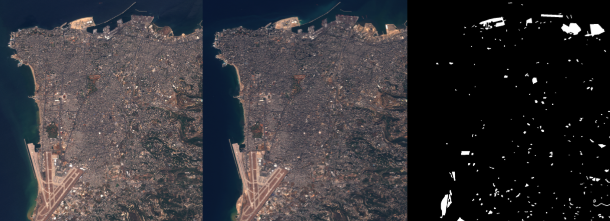

# Onera Satellite Change Detection dataset

## Description
The Onera Satellite Change Detection dataset addresses the issue of detecting changes between satellite images from different dates.

It comprises 24 pairs of multispectral images taken from the Sentinel-2 satellites between 2015 and 2018. Locations are picked all over the world, in Brazil, USA, Europe, Middle-East and Asia. For each location, registered pairs of 13-band multispectral satellite images obtained by the Sentinel-2 satellites are provided. Images vary in spatial resolution between 10m, 20m and 60m.

Pixel-level change ground truth is provided for all 14 training and 10 test image pairs. The annotated changes focus on urban changes, such as new buildings or new roads. These data can be used for training and setting parameters of change detection algorithms.

## References
If you use this data set for your projects, please take the time to cite their paper:

[1] Daudt, R.C., Le Saux, B., Boulch, A. and Gousseau, Y., 2018, July. Urban Change Detection for Multispectral Earth Observation Using Convolutional Neural Networks. In IEEE International Geoscience and Remote Sensing Symposium (IGARSS) 2018 (pp. 2115-2118). IEEE.

## Links
The original websith of this dataset is https://rcdaudt.github.io/oscd/