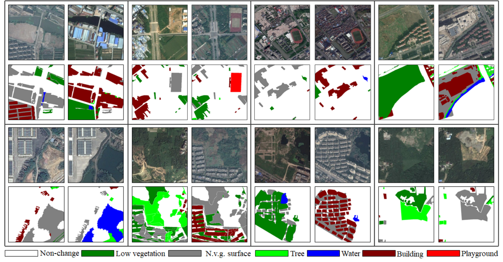

# SEmantic Change detectiON Dataset (SECOND)
<div align=center></div>

## Description
SECOND dataset is a well-annotated semantic change detection dataset, containing 4662 pairs of aerial images from several platforms and sensors. These pairs of images are distributed over the cities such as Hangzhou, Chengdu, and Shanghai. Each image has size 512 x 512 and is annotated at the pixel level. The annotation of SECOND is carried out by an expert group of earth vision applications, which guarantees high label accuracy. For the change category in the SECOND dataset, we focus on 6 main land-cover classes, i.e. , non-vegetated ground surface, tree, low vegetation, water, buildings and playgrounds , that are frequently involved in natural and man-made geographical changes.

## Links
You can download this dataset in http://www.captain-whu.com/PROJECT/SCD/

## References
If you use this dataset for your projects, please take the time to cite their paper:  
```
@misc{yang2020asymmetric,
title={Asymmetric Siamese Networks for Semantic Change Detection}, 
author={Kunping Yang and Gui-Song Xia and Zicheng Liu and Bo Du and Wen Yang and Marcello Pelillo},
year={2020},
eprint={arXiv:2010.05687},
}
```