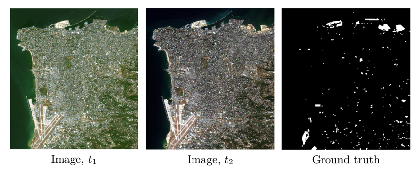

# Sentinel-2 Multitemporal Cities Pairs
<div align=center></div>

## Description
This dataset contains 1520 Sentinel-2 level 1C image pairs focused on urban areas around the world.Bands with a spatial resolution smaller than 10 m are resampled to 10 m and images are cropped to approximately 600x600 pixels. The size of some images is smaller than 600x600 pixels as result of the fact that some coordinates were located close to the edge of a Sentinel tile, the images were then cropped to the tile border. Geometric or radiometric corrections are not performed.

The dataset is released with the conference article: Marrit Leenstra, Diego Marcos, Francesca Bovolo and Devis Tuia, Self-supervised pre-training enhances change detection in Sentinel-2 imagery, PRRS workshop, ICPR 2020
## Links
The original websith of this dataset is https://zenodo.org/record/4280482#.YGCO4bCSnba

## References
If you use this data set for your projects, please take the time to cite their paper:  
```
@InProceedings{10.1007/978-3-030-68787-8_42,
author="Leenstra, Marrit
and Marcos, Diego
and Bovolo, Francesca
and Tuia, Devis",
title="Self-supervised Pre-training Enhances Change Detection in Sentinel-2 Imagery",
booktitle="Pattern Recognition. ICPR International Workshops and Challenges",
year="2021",
pages="578--590",
}
```
