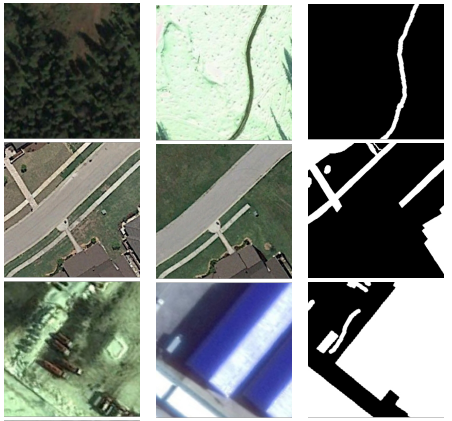

# Season Varying Change Detection Dataset

## Description
Season-varying dataset (SVCD) acquired from Google Earth, including seven season-varying image-pairs with a size of 4725 2200 pixels and four season-varying image-pairs with a size of 1900x1000 pixels. The spatial resolution of these images varies from 0.03m to 1m per pixel. The authors cropped these 11 multi-temporal image-pairs into image patchpairs with a size of 256x256 pixels. Finally, the SVCD dataset contains 10000 image-pairs for training, 3000 imagepairs for validation, and 3000 image-pairs for testing. 

## Links
The created database is available for public access at https://drive.google.com/file/d/1GX656JqqOyBi_Ef0w65kDGVto-nHrNs9

## References
If you use this dataset in your work, please take the time to cite their paper:  
[1] M. Lebedev, Y. V. Vizilter, O. Vygolov, V. Knyaz, and A. Y. Rubis, “Change detection in remote sensing images using conditional adversarial networks,” International Archives of the Photogrammetry, Remote Sensing & Spatial Information Sciences, vol. 42, no. 2, 2018.
