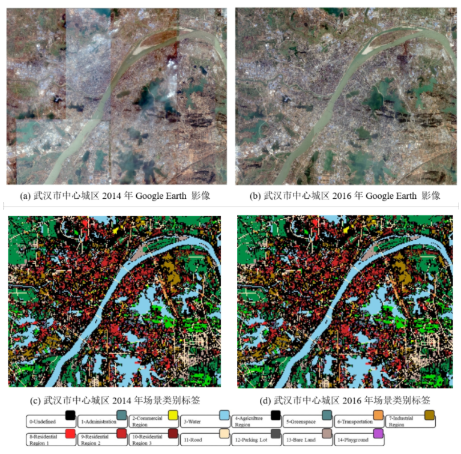
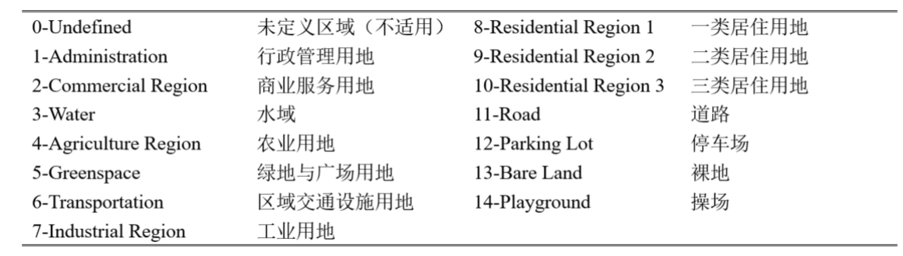

# Wuhan Multi-Application VHR Scene classification (WH-MAVS) Dataset

## Description of the dataset
The WH-MAVS dataset is the only large scale, multi-application, multi-temporal, georeferenced scene classification dataset that has been annotated around the central area of a megacity. The dataset can not only be used for theoretical research and validation of scene classification and scene change detection methods, but can also be directly applied to the practical production of land-cover and land-use, such as urban mapping and planning, landscape ecology analysis and urban environmental dynamic monitoring, thus realising the "application gap" from algorithm to application.

This dataset is acquired from Google Earth images with a spatial resolution of 1.2 m and a large size of 47537×38100 pixels. The coverage area is the central city of Wuhan, China, covering more than 6800 km2. The images were acquired in 2014 and 2016, and contain three bands: red, green and blue. The dataset is easily cropped on the original image with each block size of 200×200 pixels without overlapping, and all samples in the two time phases correspond to each other geographically, each time phase includes 23,202 samples of change areas and 365 samples of change.

The training samples, validation samples and test samples of the whole dataset are selected from large scale high resolution remote sensing images. The sample size for each temporal data is 23,567, for a total of 47,134 samples in the WH-MAVS dataset. Each temporal training set consisted of 16,496 image blocks and the validation set consisted of 4,713 image blocks. The test set consisted of 2,356 images. The scene image blocks from the training set, validation set and test set were divided into a total of 14 categories as follows:

0-undefined represents scene images that are difficult to distinguish the land-use classes and don't participate in the accuracy evaluation.

## Link
You can download this dataset in the website: http://sigma.whu.edu.cn/newspage.php?q=2021_06_27 

## Citation
If you use these datasets in your work, please take the time to cite our paper:  
[1] L. Ru, B. Du and C. Wu, "Multi-Temporal Scene Classification and Scene Change Detection With Correlation Based Fusion," in IEEE Transactions on Image Processing, vol. 30, pp. 1382-1394, 2021.