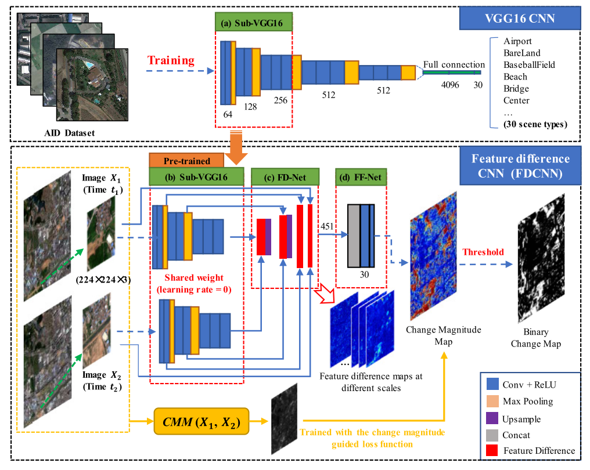
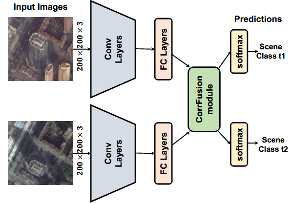
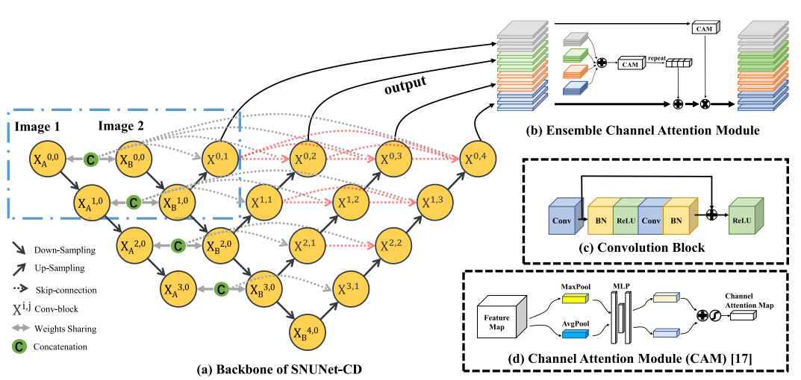

# Change Detection Repository
In this repository, we provide python implementation of some traditional change detection methods, such as SFA, MAD, some deep learning-based change detection methods, such as SiamCRNN, DSFA, and FCN-based methods, or their original websites. Some [multi-temporal datasets](https://github.com/I-Hope-Peace/ChangeDetectionRepository/tree/master/Dataset) are also contained in this repository. We would be very glad if this repository can provide some help to your research in change detection or remote sensing image interpretation.

## Traditional Methods
### Change Vector Analysis (CVA)
Change vector analysis (CVA) [1] is a most commonly used method, which can provide change intensity and change direction. 

### Slow Feature Analysis (SFA)

Wu et al. [2] proposed a novel CD method based on slow feature analysis (SFA), which aims to find the most invariant component in multitemporal images to highlight changed regions. In addition to change detection, SFA was also used in radiometric correction [3] and scene change detection [4]. This reporisty contains the Python implementation of SFA and iterative SFA. The MATLAB implementation can be founded in http://sigma.whu.edu.cn/resource.php. 

### Multivariate Alteration Detection (MAD)
MAD is a change detection algorithm based on canonical correlation analysis (CCA) that aims to maximize the variance of projection feature difference. For the detailed introduction about MAD, please refer to [5] and [6]. This reporisty contains the python implementation of MAD. The MATLAB implementation can be founded in http://www.imm.dtu.dk/~alan/software.html. 

### PCA-Kmeans

PCA-Kmeans [12] partitones the difference image into nonoverlapping blocks. Orthonormal eigenvectors are extracted through PCA of nonoverlapping block set to create an eigenvector space. Each pixel in the difference image is represented with an S-dimensional feature vector which is the projection difference image data onto the generated eigenvector space. The change detection is achieved by partitioning the feature vector space into two clusters using k-means. 

## Deep Learning Methods
### Deep Slow Feature Analysis (DSFA)

DSFA is an unsupervised change detection model that utilizes a dual-stream deep neural network to learn non-linear features and highlights changes via linear SFA. For the detailed introduction about DSFA, please refer to [7]. The Tensorflow implementation of DSFA can be founded in https://github.com/rulixiang/DSFANet or http://sigma.whu.edu.cn/resource.php. 

### Deep Siamese Convolutional Multiple-Layers Recurrent Neural Network (SiamCRNN)

SiamCRNN is an end-to-end general multi-source change detection architecture that consists of three subnetworks: deep siamese convolutional neural network (DSCNN), multiple-layers RNN (MRNN), and fully connected (FC) layers. The DSCNN has a flexible structure for multisource image and is able to extract spatial–spectral features from homogeneous or heterogeneous VHR image patches. The MRNN stacked by long-short term memory (LSTM) units is responsible for mapping the spatial–spectral features extracted by DSCNN into a new latent feature space and mining the change information between them. In addition, FC, the last part of SiamCRNN, is adopted to predict change probability. For the detailed introduction about DSFA, please refer to [8]. The Tensorflow implementation of SiamCRNN can be founded in https://github.com/I-Hope-Peace/SiamCRNN.

### Deep Kernel PCA Convolutional Mapping Network (KPCA-MNet)

KPCA-MNet is designed for unsupervised binary and multi-class change detection in very-high-resolution images. In the KPCA-MNet, the high-level spatial-spectral feature maps are extracted by a deep siamese network consisting of weight-shared KPCA convolutional layers. Then, the change information in the feature difference map is mapped into a 2-D polar domain. Finally, the change detection results are generated by threshold segmentation and clustering algorithms. For the detailed introduction about DSFA, please refer to [9]. The Python implementation can be founded in https://github.com/I-Hope-Peace/KPCAMNet. 

### Deep Siamese Multi-scale Convolutional Neural Network
In iterature [14] and [15], a multi-scale feature convolution unit (MFCU) is adopted for change detection in multi-temporal VHR images. MFCU can extract multi-scale spatial-spectral features in the same layer. Based on the unit two novel deep siamese convolutional neural networks, called as deep siamese multi-scale convolutional network (DSMS-CN) and deep siamese multi-scale fully convolutional network (DSMS-FCN), are designed for unsupervised and supervised change detection, respectively. Tensorflow implementation of this work can be founded in https://github.com/I-Hope-Peace/DSMSCN.

### SARPCANet

SARPCANet utilizes Gabor wavelets and FCM as the pre-classification method to select training samples [10], and then trains a PCANet [11] model with the selected image patches. The original MATLAB implementation could be founded in https://github.com/summitgao/SAR_Change_Detection_GarborPCANet. 

### FDCNN

FDCNN [13] uses scene-level samples of remote sensing scene classification for learning deep features from different remote sensing scenes at different scales. Then, a new CNN structure and training strategies are proposed for remote sensing image change detection, which is supervised but requires very few pixel-level training samples.The original Caffe implementation could be founded in https://github.com/MinZHANG-WHU/FDCNN. 

### DCVA
DCVA [16] processes pre-change and post-change images through a pre-trained network and extracts bi-temporal deep features for subsequent processing in CD framework. The original Caffe implementation could be founded in https://github.com/sudipansaha/dcvaVHROptical. 

### CorrFusionNet

CorrFusionNet [17] is a unified network called CorrFusionNet for scene change detection. The CorrFusionNet firstly extracts the features of the bi-temporal inputs with deep convolutional networks. Then the extracted features will be projected into a lower dimension space to computed the instance level canonical correlation. The cross-temporal fusion will be performed based on the computed correlation in the CorrFusion module. In the objective function, the authors introduced a new formulation for calculating the temporal correlation. The original Tensorflow implementation could be founded in https://github.com/rulixiang/CorrFusionNet. 

### SNUNet

SNUNet-CD [18] is a densely connected siamese network for change detection, namely SNUNet-CD (the combination of Siamese network and NestedUNet). SNUNet-CD alleviates the loss of localization information in the deep layers of neural network through compact information transmission between encoder and decoder, and between decoder and decoder. In addition, Ensemble Channel Attention Module (ECAM) is proposed for deep supervision. The original pytorch implementation could be founded in https://github.com/likyoo/Siam-NestedUNet. 

## Other Change Detection Repository
There also exist some other change detection repositories, you can visit them through below links:  
[1] https://github.com/Bobholamovic/ChangeDetectionToolbox  
[2] https://github.com/MinZHANG-WHU/Change-Detection-Review  
[3] https://github.com/wenhwu/awesome-remote-sensing-change-detection

## Reference
[1] F. Bovolo and L. Bruzzone, “A Theoretical Framework for Unsupervised Change Detection Based on Change Vector Analysis in the Polar Domain,” IEEE Trans. Geosci. Remote Sens., vol. 45, no. 1, pp. 218–236, 2007.  
[2] C. Wu, B. Du, and L. Zhang, “Slow feature analysis for change detection in multispectral imagery,” IEEE Trans. Geosci. Remote Sens., vol. 52, no. 5, pp. 2858–2874, 2014.  
[3] L. Zhang, C. Wu, and B. Du, “Automatic radiometric normalization for multitemporal remote sensing imagery with iterative slow feature analysis,” IEEE Trans. Geosci. Remote Sens., vol. 52, no. 10, pp. 6141–6155, 2014.  
[4] C. Wu, L. Zhang, and B. Du, “Kernel Slow Feature Analysis for Scene Change Detection,” IEEE Trans. Geosci. Remote Sens., vol. 55, no. 4, pp. 2367–2384, 2017.  
[5] A. A. Nielsen, K. Conradsen, and J. J. Simpson, “Multivariate alteration detection (MAD) and MAF Postprocessing in multispectral, bitemporal image data: New approaches to change detection studies,” Remote Sens. Environ., vol. 64, pp. 1–19, 1998.  
[6] A. A. Nielsen, “The regularized iteratively reweighted MAD method for change detection in multi- and hyperspectral data,” IEEE Trans. Image Process., vol. 16, no. 2, pp. 463–478, 2007.  
[7] B. Du, L. Ru, C. Wu, and L. Zhang, “Unsupervised Deep Slow Feature Analysis for Change Detection in Multi-Temporal Remote Sensing Images,” IEEE Trans. Geosci. Remote Sens., vol. 57, no. 12, pp. 9976–9992, 2019.  
[8] H. Chen, C. Wu, B. Du, L. Zhang, and L. Wang, “Change Detection in Multisource VHR Images via Deep Siamese Convolutional Multiple-Layers Recurrent Neural Network,” IEEE    Trans. Geosci. Remote Sens., vol. 58, no. 4, pp. 2848–2864, 2020.  
[9] C. Wu,  H. Chen, B. Do, and L. Zhang, “Unsupervised Change Detection in Multi-temporal VHR Images Based on Deep Kernel PCA Convolutional Mapping Network,” arXiv preprint arXiv:1912.08628, 2019. https://arxiv.org/abs/1912.08628v1.  
[10] F. Gao, J. Dong, B. Li, and Q. Xu, “Automatic Change Detection in Synthetic Aperture Radar Images Based on PCANet,” IEEE Geosci. Remote Sens. Lett., vol. 13, no. 12, pp. 1792–1796, 2016.  
[11] T. H. Chan, K. Jia, S. Gao, J. Lu, Z. Zeng, and Y. Ma, “PCANet: A Simple Deep Learning Baseline for Image Classification?,” IEEE Trans. Image Process., vol. 24, no. 12, pp. 5017–5032, 2015.  
[12] T. Celik, “Unsupervised change detection in satellite images using principal component analysis and K-means clustering,” IEEE Geosci. Remote Sens. Lett., vol. 6, no. 4, pp. 772–776, 2009.  
[13] M. Zhang and W. Shi, “A Feature Difference Convolutional Neural Network-Based Change Detection Method,” IEEE Trans. Geosci. Remote Sens., vol. 58, no. 10, pp. 7232–7246, 2020.
[14] H. Chen, C. Wu, B. Du and L. Zhang, "Deep Siamese Multi-scale Convolutional Network for Change Detection in Multi-temporal VHR Images," 2019 10th International Workshop on the Analysis of Multitemporal Remote Sensing Images (MultiTemp), Shanghai, China, 2019, pp. 1-4.  
[15] H. Chen, C. Wu, B. Du and L. Zhang, "Change Detection in Multi-temporal VHR Images Based on Deep Siamese Multi-scale Convolutional Neural Network," arXiv preprint arXiv:1912.08628, 2020. https://arxiv.org/abs/1906.11479.  
[16] S. Saha, F. Bovolo, and L. Bruzzone, “Unsupervised deep change vector analysis for multiple-change detection in VHR Images,” IEEE Trans. Geosci. Remote Sens., vol. 57, no. 6, pp. 3677–3693, 2019.  
[17] L. Ru, B. Du and C. Wu, "Multi-Temporal Scene Classification and Scene Change Detection with Correlation based Fusion," in IEEE Transactions on Image Processing, doi: 10.1109/TIP.2020.3039328.  
[18] S. Fang, K. Li, J. Shao and Z. Li, "SNUNet-CD: A Densely Connected Siamese Network for Change Detection of VHR Images," in IEEE Geoscience and Remote Sensing Letters, doi: 10.1109/LGRS.2021.3056416.  
## Q & A
**For any questions, please [contact us.](mailto:Qschrx@gmail.com)**
